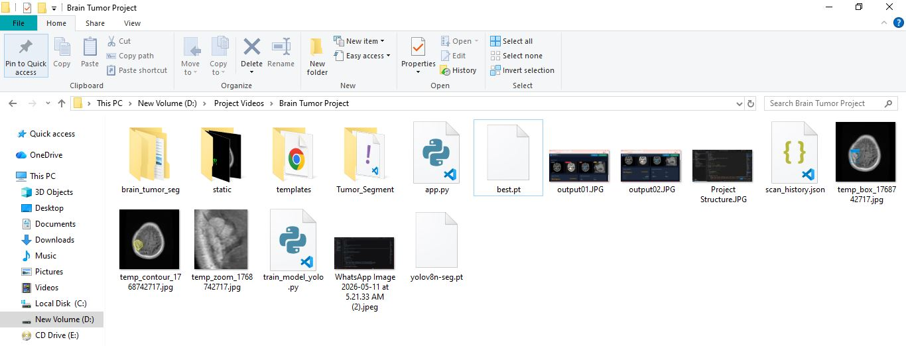
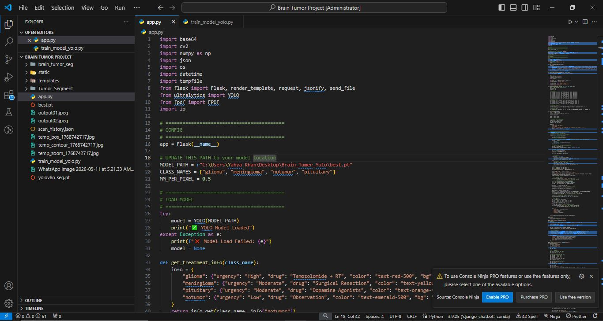
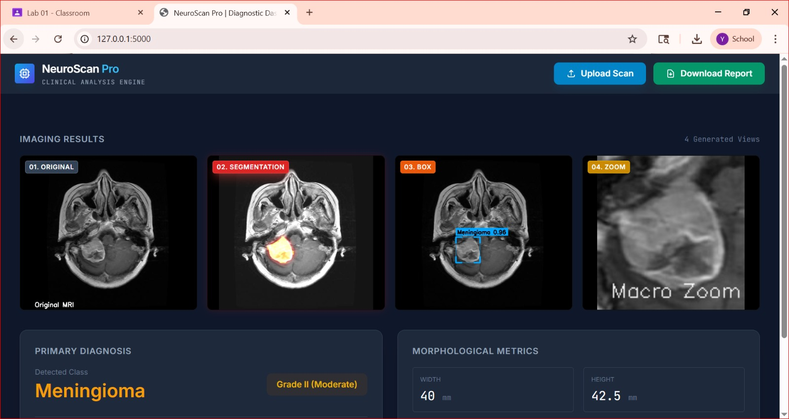
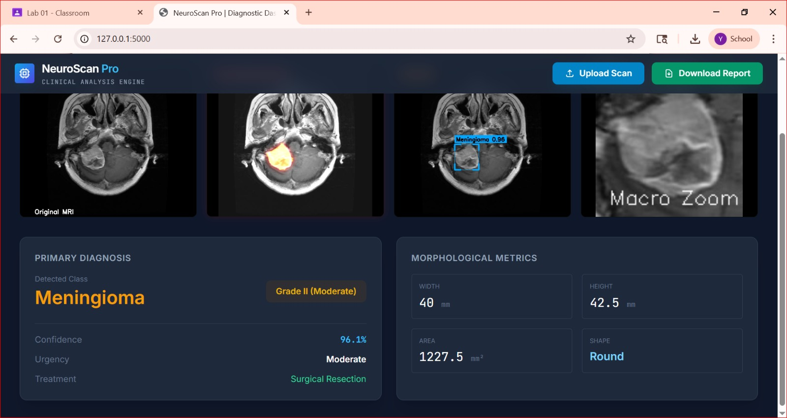

# 🧠 Brain Tumor Segmentation & Diagnosis System

[](https://www.python.org/)
[](https://flask.palletsprojects.com/)
[](https://github.com/ultralytics/ultralytics)
[]()

> An AI-powered web application for brain tumor detection, segmentation, and clinical diagnosis using YOLOv8 segmentation models.

---

## 📌 Table of Contents

- [Overview](#-overview)
- [Key Features](#-key-features)
- [Demo & Output](#-demo--output)
- [Project Structure](#-project-structure)
- [Quick Start](#-quick-start)
- [Model Training](#-model-training)
- [API Endpoints](#-api-endpoints)
- [Clinical Grading System](#-clinical-grading-system)
- [Treatment Protocols](#-treatment-protocols)
- [Troubleshooting](#-troubleshooting)
- [Technical Details](#-technical-details)
- [Disclaimer](#-disclaimer)

---

## 📌 Overview

**NeuroScan Pro** is a comprehensive web-based system that leverages state-of-the-art YOLOv8 segmentation to detect and analyze brain tumors from MRI scans. The system provides radiologist-grade analysis including tumor localization, morphological measurements, clinical grading, and downloadable PDF reports.

### Why This Project?

Brain tumor diagnosis requires precise segmentation and measurement. Traditional methods are time-consuming and subjective. This system provides:

- **Automated segmentation** with pixel-perfect accuracy
- **Quantitative measurements** (area, dimensions, shape analysis)
- **Clinical grading** based on standardized criteria
- **Actionable treatment recommendations**

---

## 🎯 Key Features

| Feature | Description |
|---------|-------------|
| 🎯 **Multi-Class Detection** | Glioma, Meningioma, Pituitary tumor, or No Tumor |
| 🔬 **Pixel-Perfect Segmentation** | Accurate tumor boundary detection using YOLOv8 |
| 📊 **4-Panel Visualization** | Original MRI, Heatmap, Bounding Box, Macro Zoom |
| 📐 **Morphological Metrics** | Width, Height, Area, Shape analysis |
| 🏥 **Clinical Grading** | Automated Grade I-III classification |
| 💊 **Treatment Recommendations** | Drug regimen & urgency assessment |
| 📄 **PDF Report Generation** | Comprehensive radiology reports |
| 🎨 **Modern UI** | Responsive dashboard with real-time analysis |

---

## 📸 Demo & Output

### Project Files Structure


### Project Structure 


### Sample Output 
### Output Sample 


### Output Sample 



### Important Path Configuration

In `app.py`, set your model paths like this:

```python
# Model paths - adjust according to your folder structure
MODEL_PATH = "models/best.pt"           # Path to trained model
BASE_MODEL_PATH = "models/yolov8n-seg.pt" # Path to base YOLO model

## 📦 requirements.txt

Create `requirements.txt` with:

```txt
flask==2.3.3
ultralytics==8.0.196
opencv-python==4.8.1.78
numpy==1.24.3
fpdf==1.7.2
torch==2.0.1
torchvision==0.15.2
pillow==10.0.0
matplotlib==3.7.1
